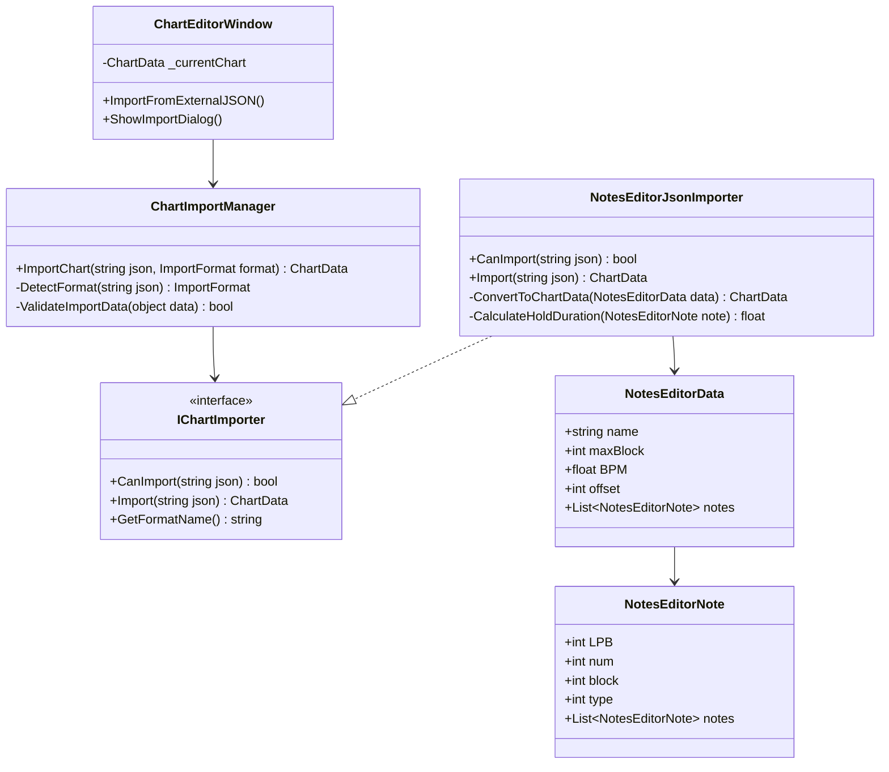
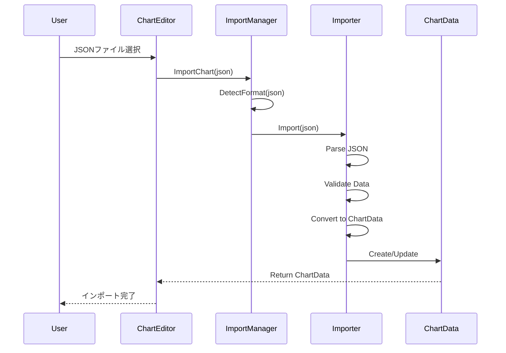

# ChartEditor JSON インポート機能 詳細設計書

## 概要

本書は、既存の外部JSON形式（NotesEditor形式）の譜面データを、JirouプロジェクトのChartDataフォーマットに変換・インポートする機能の詳細設計を定義します。

## 背景と目的

### 背景
- 既存の譜面データ（End_Time.json等）が外部ツールで作成されている
- 現在のChartEditorのインポート機能は独自フォーマットのみサポート
- 外部譜面データの活用により、コンテンツ制作効率を向上させる必要がある

### 目的
1. 外部JSON形式の譜面データをChartDataに変換する機能の提供
2. 複数の譜面フォーマットに対応可能な拡張性のある設計
3. データ変換時の整合性チェックとエラーハンドリング

## 外部JSON形式の分析

### NotesEditor形式の構造

```json
{
  "name": "End_Time",           // 曲名（楽曲名）
  "maxBlock": 5,                // 最大ブロック数（未使用）
  "BPM": 180,                   // BPM値
  "offset": 29800,              // オフセット（ミリ秒）
  "notes": [                    // ノーツ配列
    {
      "LPB": 4,                // Lines Per Beat（1ビートあたりの分割数）
      "num": 272,              // タイミング（LPB単位）
      "block": 0,              // レーン番号（0-3）
      "type": 2,               // ノーツタイプ（1=Tap, 2=Hold）
      "notes": [               // Holdノーツの終了位置（type=2の場合のみ）
        {
          "LPB": 4,
          "num": 288,
          "block": 0,
          "type": 2,
          "notes": []
        }
      ]
    }
  ]
}
```

### データマッピング仕様

| 外部形式フィールド | ChartDataフィールド | 変換ロジック |
|-----------------|------------------|------------|
| name | songName | 直接マッピング |
| BPM | bpm | 直接マッピング |
| offset | firstBeatOffset | ミリ秒→秒→ビート単位への変換 |
| notes[].block | NoteData.laneIndex | 直接マッピング（0-3） |
| notes[].type | NoteData.noteType | 1→Tap, 2→Hold |
| notes[].num | NoteData.timeToHit | num / LPB（ビート単位） |
| notes[].notes | NoteData.holdDuration | (終了num - 開始num) / LPB |

## システムアーキテクチャ

### クラス構造



### データフロー



## 詳細設計

### NotesEditorJsonImporter クラス

```csharp
namespace Jirou.Editor.Import
{
    /// <summary>
    /// NotesEditor形式のJSONインポーター
    /// </summary>
    public class NotesEditorJsonImporter : IChartImporter
    {
        public string GetFormatName() => "NotesEditor JSON";
        
        public bool CanImport(string json)
        {
            try
            {
                var data = JsonUtility.FromJson<NotesEditorData>(json);
                return data != null && 
                       data.notes != null && 
                       !string.IsNullOrEmpty(data.name);
            }
            catch
            {
                return false;
            }
        }
        
        public ChartData Import(string json)
        {
            var NotesEditorData = ParseJson(json);
            ValidateData(NotesEditorData);
            return ConvertToChartData(NotesEditorData);
        }
        
        private NotesEditorData ParseJson(string json)
        {
            var data = JsonUtility.FromJson<NotesEditorData>(json);
            if (data == null)
            {
                throw new ImportException("JSONの解析に失敗しました");
            }
            return data;
        }
        
        private void ValidateData(NotesEditorData data)
        {
            if (data.BPM <= 0)
            {
                throw new ImportException($"無効なBPM値: {data.BPM}");
            }
            
            if (data.notes == null)
            {
                throw new ImportException("ノーツデータが存在しません");
            }
            
            foreach (var note in data.notes)
            {
                if (note.block < 0 || note.block > 3)
                {
                    throw new ImportException($"無効なレーン番号: {note.block}");
                }
                
                if (note.type != 1 && note.type != 2)
                {
                    throw new ImportException($"無効なノーツタイプ: {note.type}");
                }
            }
        }
        
        private ChartData ConvertToChartData(NotesEditorData data)
        {
            var chartData = ScriptableObject.CreateInstance<ChartData>();
            
            // 基本情報の設定
            SetChartMetadata(chartData, data);
            
            // ノーツデータの変換
            ConvertNotes(chartData, data);
            
            // ソートと検証
            chartData.SortNotesByTime();
            
            return chartData;
        }
        
        private void SetChartMetadata(ChartData chartData, NotesEditorData data)
        {
            // ChartDataのプロパティ設定（リフレクションまたはSerializedObjectを使用）
            var so = new SerializedObject(chartData);
            
            so.FindProperty("_songName").stringValue = data.name;
            so.FindProperty("_bpm").floatValue = data.BPM;
            so.FindProperty("_firstBeatOffset").floatValue = ConvertOffsetToBeats(data.offset, data.BPM);
            so.FindProperty("_difficulty").intValue = 5; // デフォルト値
            so.FindProperty("_difficultyName").stringValue = "Normal";
            
            so.ApplyModifiedProperties();
        }
        
        private float ConvertOffsetToBeats(int offsetMs, float bpm)
        {
            // ミリ秒をビート単位に変換
            float offsetSeconds = offsetMs / 1000f;
            float beatDuration = 60f / bpm;
            return offsetSeconds / beatDuration;
        }
        
        private void ConvertNotes(ChartData chartData, NotesEditorData data)
        {
            chartData.Notes.Clear();
            
            foreach (var NotesEditorNote in data.notes)
            {
                var noteData = ConvertNote(NotesEditorNote);
                if (noteData != null)
                {
                    chartData.Notes.Add(noteData);
                }
            }
        }
        
        private NoteData ConvertNote(NotesEditorNote notesEditorNote)
        {
            var noteData = new NoteData();
            
            // 基本プロパティの設定
            noteData.LaneIndex = NotesEditorNote.block;
            noteData.NoteType = NotesEditorNote.type == 1 ? NoteType.Tap : NoteType.Hold;
            noteData.TimeToHit = (float)NotesEditorNote.num / NotesEditorNote.LPB;
            
            // Holdノーツの場合、duration計算
            if (noteData.NoteType == NoteType.Hold && NotesEditorNote.notes != null && NotesEditorNote.notes.Count > 0)
            {
                var endNote = NotesEditorNote.notes[0];
                float NotesEditor = (float)endNote.num / endNote.LPB;
                noteData.HoldDuration = NotesEditor - noteData.TimeToHit;
            }
            
            // デフォルト値の設定
            noteData.VisualScale = 1.0f;
            noteData.NoteColor = Color.white;
            noteData.BaseScore = 100;
            noteData.ScoreMultiplier = 1.0f;
            
            return noteData;
        }
    }
}
```

### ChartImportManager クラス

```csharp
namespace Jirou.Editor.Import
{
    /// <summary>
    /// 譜面インポート管理クラス
    /// </summary>
    public static class ChartImportManager
    {
        private static readonly List<IChartImporter> importers = new List<IChartImporter>
        {
            new NotesEditorJsonImporter(),
            // 将来的に他のインポーターを追加
        };
        
        public static bool TryImport(string json, out ChartData chartData, out string error)
        {
            chartData = null;
            error = null;
            
            foreach (var importer in importers)
            {
                if (importer.CanImport(json))
                {
                    try
                    {
                        chartData = importer.Import(json);
                        return true;
                    }
                    catch (Exception e)
                    {
                        error = $"{importer.GetFormatName()}のインポート失敗: {e.Message}";
                        Debug.LogError(error);
                    }
                }
            }
            
            error = "対応するインポート形式が見つかりませんでした";
            return false;
        }
        
        public static string[] GetSupportedFormats()
        {
            return importers.Select(i => i.GetFormatName()).ToArray();
        }
    }
}
```

## エラーハンドリング

### エラーの種類と対処

| エラー種別 | 説明 | 対処方法 |
|----------|------|---------|
| JSONパースエラー | JSON構文が不正 | エラーメッセージ表示、インポート中止 |
| フォーマット不一致 | 必須フィールドの欠如 | 対応フォーマット候補を提示 |
| データ検証エラー | 値の範囲外、不正な値 | 詳細なエラー内容を表示 |
| 変換エラー | データ変換中の例外 | ログ記録、部分的なインポート |

### エラー時のフォールバック

```csharp
public class ImportFallbackHandler
{
    public static ChartData CreateFallbackChart(string name, float bpm)
    {
        var chartData = ScriptableObject.CreateInstance<ChartData>();
        
        // 最小限の情報で譜面を作成
        var so = new SerializedObject(chartData);
        so.FindProperty("_songName").stringValue = name ?? "Imported Chart";
        so.FindProperty("_bpm").floatValue = bpm > 0 ? bpm : 120f;
        so.ApplyModifiedProperties();
        
        return chartData;
    }
    
    public static void LogImportWarnings(List<string> warnings)
    {
        if (warnings.Count > 0)
        {
            Debug.LogWarning($"インポート時の警告 ({warnings.Count}件):");
            foreach (var warning in warnings)
            {
                Debug.LogWarning($"  - {warning}");
            }
        }
    }
}
```

## UI/UX設計

### インポートダイアログの改善

```csharp
public class ImportDialog : EditorWindow
{
    private string jsonPreview;
    private ImportFormat detectedFormat;
    private List<string> validationMessages;
    
    public static void ShowDialog(string json)
    {
        var window = GetWindow<ImportDialog>("譜面インポート");
        window.jsonPreview = json;
        window.AnalyzeJson();
    }
    
    void OnGUI()
    {
        EditorGUILayout.LabelField("インポート形式", detectedFormat.ToString());
        
        // JSON プレビュー（折りたたみ可能）
        DrawJsonPreview();
        
        // 検証結果の表示
        DrawValidationResults();
        
        // インポートボタン
        DrawImportButtons();
    }
}
```

### プログレス表示

```csharp
public class ImportProgressReporter
{
    public static void ShowProgress(string title, string info, float progress)
    {
        EditorUtility.DisplayProgressBar(title, info, progress);
    }
    
    public static void ReportNoteConversion(int current, int total)
    {
        float progress = (float)current / total;
        ShowProgress("譜面インポート中", 
                    $"ノーツを変換中... ({current}/{total})", 
                    progress);
    }
}
```

## パフォーマンス最適化

### 大量ノーツデータの処理

```csharp
public class BatchNoteConverter
{
    private const int BATCH_SIZE = 100;
    
    public IEnumerator ConvertNotesAsync(
        List<NotesEditorNote> sourceNotes, 
        ChartData targetChart,
        Action<float> onProgress)
    {
        int totalNotes = sourceNotes.Count;
        int processed = 0;
        
        for (int i = 0; i < totalNotes; i += BATCH_SIZE)
        {
            int batchEnd = Mathf.Min(i + BATCH_SIZE, totalNotes);
            
            // バッチ処理
            for (int j = i; j < batchEnd; j++)
            {
                var noteData = ConvertNote(sourceNotes[j]);
                targetChart.Notes.Add(noteData);
                processed++;
            }
            
            // 進捗報告
            onProgress?.Invoke((float)processed / totalNotes);
            
            // フレーム譲渡
            yield return null;
        }
    }
}
```

### メモリ使用量の最適化

```csharp
public class MemoryOptimizedImporter
{
    public ChartData ImportLargeFile(string filePath)
    {
        using (var reader = new StreamReader(filePath))
        using (var jsonReader = new JsonTextReader(reader))
        {
            // ストリーミング処理でメモリ使用量を削減
            var serializer = new JsonSerializer();
            var data = serializer.Deserialize<NotesEditorData>(jsonReader);
            return ConvertToChartData(data);
        }
    }
}
```

## テスト計画

### ユニットテスト

```csharp
[TestFixture]
public class NotesEditorJsonImporterTests
{
    [Test]
    public void TestBasicImport()
    {
        string json = @"{
            ""name"": ""Test Song"",
            ""BPM"": 120,
            ""offset"": 0,
            ""notes"": []
        }";
        
        var importer = new NotesEditorJsonImporter();
        Assert.IsTrue(importer.CanImport(json));
        
        var chartData = importer.Import(json);
        Assert.AreEqual("Test Song", chartData.SongName);
        Assert.AreEqual(120f, chartData.Bpm);
    }
    
    [Test]
    public void TestNoteConversion()
    {
        var notesEditorNote = new NotesEditorNote
        {
            LPB = 4,
            num = 16,
            block = 2,
            type = 1
        };
        
        var noteData = ConvertNote(NotesEditorNote);
        Assert.AreEqual(4f, noteData.TimeToHit); // 16 / 4 = 4
        Assert.AreEqual(2, noteData.LaneIndex);
        Assert.AreEqual(NoteType.Tap, noteData.NoteType);
    }
    
    [Test]
    public void TestHoldNoteConversion()
    {
        var holdNote = new NotesEditorNote
        {
            LPB = 4,
            num = 8,
            block = 1,
            type = 2,
            notes = new List<NotesEditorNote>
            {
                new NotesEditorNote { LPB = 4, num = 16, block = 1, type = 2 }
            }
        };
        
        var noteData = ConvertNote(holdNote);
        Assert.AreEqual(NoteType.Hold, noteData.NoteType);
        Assert.AreEqual(2f, noteData.HoldDuration); // (16-8)/4 = 2
    }
}
```

### 統合テスト

1. **実ファイルインポートテスト**
   - End_Time.jsonの完全なインポート
   - 全ノーツの正確な変換確認
   - パフォーマンス測定

2. **エラーハンドリングテスト**
   - 不正なJSONファイル
   - 欠損データの処理
   - 大容量ファイルの処理

3. **互換性テスト**
   - 異なるバージョンのJSON形式
   - 拡張フィールドの処理
   - 後方互換性の確保

## セキュリティ考慮事項

### 入力検証

```csharp
public class ImportSecurityValidator
{
    private const int MAX_FILE_SIZE_MB = 10;
    private const int MAX_NOTES_COUNT = 10000;
    
    public static bool ValidateFileSize(string filePath)
    {
        var fileInfo = new FileInfo(filePath);
        return fileInfo.Length <= MAX_FILE_SIZE_MB * 1024 * 1024;
    }
    
    public static bool ValidateNoteCount(int count)
    {
        return count <= MAX_NOTES_COUNT;
    }
    
    public static string SanitizeString(string input)
    {
        if (string.IsNullOrEmpty(input))
            return "";
            
        // 危険な文字を除去
        return Regex.Replace(input, @"[<>""']", "");
    }
}
```

## 拡張性

### 新しいインポート形式の追加

```csharp
// 例: osu!形式のインポーター
public class OsuBeatmapImporter : IChartImporter
{
    public string GetFormatName() => "osu! Beatmap";
    
    public bool CanImport(string content)
    {
        return content.Contains("osu file format");
    }
    
    public ChartData Import(string content)
    {
        // osu!形式の解析と変換
        var beatmap = ParseOsuBeatmap(content);
        return ConvertToChartData(beatmap);
    }
}
```

### プラグインシステム

```csharp
public interface IImportPlugin
{
    string Name { get; }
    string Version { get; }
    string[] SupportedExtensions { get; }
    IChartImporter CreateImporter();
}

public class ImportPluginManager
{
    private static List<IImportPlugin> plugins = new List<IImportPlugin>();
    
    public static void RegisterPlugin(IImportPlugin plugin)
    {
        plugins.Add(plugin);
        Debug.Log($"インポートプラグイン登録: {plugin.Name} v{plugin.Version}");
    }
}
```

## まとめ

本設計により、外部JSON形式の譜面データを柔軟にインポートできる拡張可能なシステムを実現します。End_Time.json形式を第一の対応フォーマットとし、将来的な拡張にも対応可能な設計となっています。