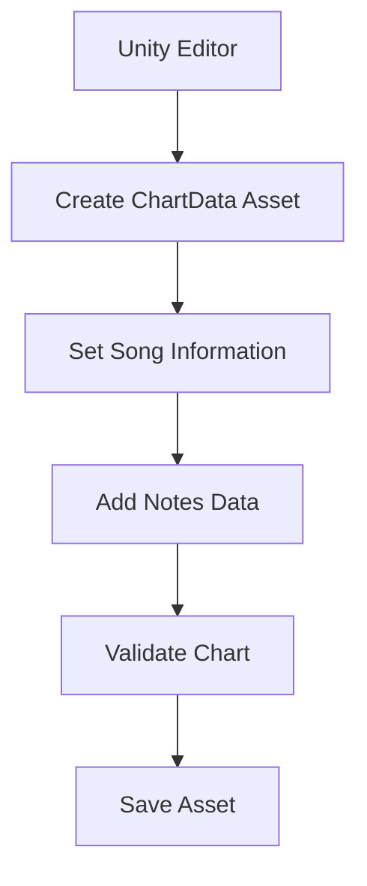
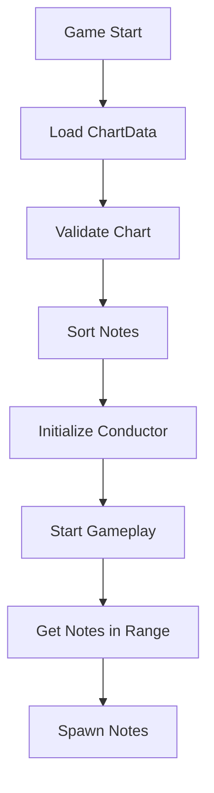

# ChartData アーキテクチャ設計書

## 概要

本書は、奥行き型リズムゲーム「Jirou」の譜面データ管理システム「ChartData」の詳細設計を定義します。ChartDataはScriptableObjectとして実装され、楽曲情報とノーツデータを統合管理し、エディタでの編集とランタイムでの効率的なアクセスを提供します。

## 設計原則

### 1. ScriptableObjectベースの設計
- Unity Editorでの直感的な編集
- アセットとしての管理による再利用性
- メモリ効率的なデータ共有

### 2. データ統合管理
- 楽曲情報とノーツデータの一元管理
- メタデータによる譜面の識別と管理
- 難易度別の譜面管理対応

### 3. 拡張性と保守性
- 新機能追加を考慮した設計
- バリデーション機能による整合性保証
- デバッグ機能の充実

## ChartDataクラス構造

### クラス定義

```csharp
[CreateAssetMenu(fileName = "NewChart", menuName = "Jirou/Chart Data", order = 1)]
public class ChartData : ScriptableObject
```

**設計理由**:
- ScriptableObjectによるアセット管理
- メニューからの簡単な作成
- プロジェクトウィンドウでの管理

### フィールド設計

#### 楽曲情報フィールド

| フィールド名 | 型 | 説明 | 制約 |
|------------|---|------|------|
| songClip | AudioClip | 楽曲ファイル | 必須 |
| bpm | float | BPM（Beats Per Minute） | 30-400 |
| songName | string | 曲名 | 必須 |
| artist | string | アーティスト名 | - |
| previewTime | float | プレビュー開始時間（秒） | 0以上 |
| firstBeatOffset | float | 最初のビートまでのオフセット | - |

**設計理由**:
- 楽曲の基本情報を網羅
- BPM範囲は実用的な値に制限
- プレビュー機能を考慮

#### 難易度情報フィールド

| フィールド名 | 型 | 説明 | 制約 |
|------------|---|------|------|
| difficulty | int | 難易度レベル | 1-10 |
| difficultyName | string | 難易度名 | - |

**設計理由**:
- 複数難易度の管理を想定
- 数値と名称の両方で表現

#### 譜面データフィールド

| フィールド名 | 型 | 説明 | 制約 |
|------------|---|------|------|
| notes | List<NoteData> | ノーツリスト | - |

**設計理由**:
- NoteDataクラスとの分離により責任を明確化
- リスト形式で動的な追加・削除に対応

#### メタデータフィールド

| フィールド名 | 型 | 説明 | 制約 |
|------------|---|------|------|
| chartAuthor | string | 譜面作成者 | - |
| chartVersion | string | 譜面バージョン | - |
| createdDate | string | 作成日時 | - |
| lastModified | string | 最終更新日時 | - |

**設計理由**:
- 譜面の管理とトラッキング
- バージョン管理による更新履歴の追跡

## メソッド設計

### 基本操作メソッド

#### SortNotesByTime()
```csharp
public void SortNotesByTime()
```
- **目的**: ノーツをタイミング順にソート
- **使用場面**: 譜面編集後、ゲームプレイ開始前
- **パフォーマンス**: O(n log n)

#### GetNotesInTimeRange()
```csharp
public List<NoteData> GetNotesInTimeRange(float startBeat, float endBeat)
```
- **目的**: 指定範囲のノーツを効率的に取得
- **使用場面**: ノーツのスポーン処理
- **パフォーマンス**: O(n)

### 統計メソッド

#### GetNoteCountByLane()
```csharp
public int[] GetNoteCountByLane()
```
- **目的**: レーン別のノーツ分布を取得
- **使用場面**: 譜面のバランス確認
- **戻り値**: 4要素の配列（各レーンのノーツ数）

#### GetTotalNoteCount() / GetTapNoteCount() / GetHoldNoteCount()
```csharp
public int GetTotalNoteCount()
public int GetTapNoteCount()
public int GetHoldNoteCount()
```
- **目的**: ノーツ数の集計
- **使用場面**: 譜面情報の表示、スコア計算の準備

#### GetChartLengthInBeats() / GetChartLengthInSeconds()
```csharp
public float GetChartLengthInBeats()
public float GetChartLengthInSeconds()
```
- **目的**: 譜面の長さを取得
- **使用場面**: プログレスバー表示、終了判定

### バリデーションメソッド

#### ValidateChart()
```csharp
public bool ValidateChart(out List<string> errors)
```
- **目的**: 譜面データの整合性チェック
- **チェック項目**:
  - BPM値の妥当性（0 < BPM ≤ 999）
  - 楽曲ファイルの存在
  - 曲名の設定
  - ノーツデータの妥当性
  - 重複ノーツの検出
  - 譜面長と楽曲長の整合性

### 統計情報メソッド

#### GetStatistics()
```csharp
public ChartStatistics GetStatistics()
```
- **目的**: 譜面の詳細統計情報を取得
- **戻り値**: ChartStatisticsオブジェクト

### デバッグメソッド

#### PrintDebugInfo()
```csharp
public void PrintDebugInfo()
```
- **目的**: 譜面情報をコンソールに出力
- **使用場面**: 開発時のデバッグ、問題調査

## ChartStatisticsクラス

```csharp
[Serializable]
public class ChartStatistics
{
    public int totalNotes;           // 総ノーツ数
    public int tapNotes;              // Tapノーツ数
    public int holdNotes;             // Holdノーツ数
    public int[] notesByLane;         // レーン別ノーツ数
    public float chartLengthBeats;    // 譜面長（ビート）
    public float chartLengthSeconds;  // 譜面長（秒）
    public float averageNPS;          // 平均Notes Per Second
    public float averageInterval;     // 平均ノーツ間隔（ビート）
}
```

**設計理由**:
- 統計情報を構造体として管理
- シリアライズ可能でエディタ表示に対応
- 譜面の難易度評価に必要な情報を網羅

## データフロー

### 譜面データの作成フロー



### 実行時のデータアクセスフロー



## パフォーマンス最適化

### メモリ最適化
- ScriptableObjectによる単一インスタンス管理
- 必要なノーツのみを範囲取得
- 統計情報のキャッシング

### 処理最適化
- ソート済みリストによる効率的な範囲検索
- レーン別集計の事前計算オプション
- バリデーションの段階的実行

## エディタ統合

### カスタムインスペクター機能
- 統計情報の表示
- ワンクリックソート
- バリデーション結果表示
- テストデータ生成

### 譜面エディタウィンドウ
- ビジュアル譜面編集
- リアルタイムプレビュー
- インポート/エクスポート機能

## エラー処理とバリデーション

### バリデーション項目

1. **データ整合性**
   - BPM値の範囲チェック
   - 必須フィールドの存在確認
   - ノーツデータの妥当性

2. **重複検出**
   - 同一タイミング・同一レーンのノーツ
   - 物理的に不可能な配置

3. **パフォーマンス警告**
   - 過密なノーツ配置
   - 異常に長い譜面

### エラー処理戦略
```csharp
// エラー情報を詳細に収集
List<string> errors;
if (!chartData.ValidateChart(out errors))
{
    foreach (var error in errors)
    {
        Debug.LogError($"[ChartData] {error}");
    }
    // エラーダイアログ表示やフォールバック処理
}
```

## 拡張性

### 将来的な拡張ポイント

1. **新しいノーツタイプ**
   - Slide、Flick等の追加
   - NoteTypeの拡張で対応

2. **複数難易度管理**
   - ChartDataのバリエーション作成
   - 難易度別アセット管理

3. **オンライン機能**
   - JSON/XMLエクスポート
   - サーバー同期対応

4. **エフェクト設定**
   - 楽曲別のビジュアルテーマ
   - カスタムエフェクト設定

## セキュリティとデータ保護

### データ検証
- 入力値の範囲制限
- 不正なデータの自動修正
- バックアップ機能

### アクセス制御
- 読み取り専用プロパティの活用
- エディタ限定機能の分離
- ランタイム編集の制限

## ベストプラクティス

### 譜面作成時
1. 必ず楽曲ファイルを先に設定
2. BPMを正確に設定
3. ノーツ追加後は必ずソート
4. バリデーションで確認

### 実装時
1. ChartDataはResourcesまたはAddressablesで管理
2. ゲーム開始時に一度だけバリデーション
3. 統計情報はキャッシュして使用
4. エラー時はフォールバック処理

### デバッグ時
1. PrintDebugInfo()で状態確認
2. ChartStatisticsで譜面分析
3. バリデーションエラーの詳細確認
4. エディタツールの活用

## まとめ

ChartDataは、Jirouの譜面データを効率的に管理するための中核システムです。ScriptableObjectベースの設計により、エディタでの編集作業とランタイムでのパフォーマンスの両立を実現しています。拡張性を考慮した設計により、将来的な機能追加にも柔軟に対応可能です。