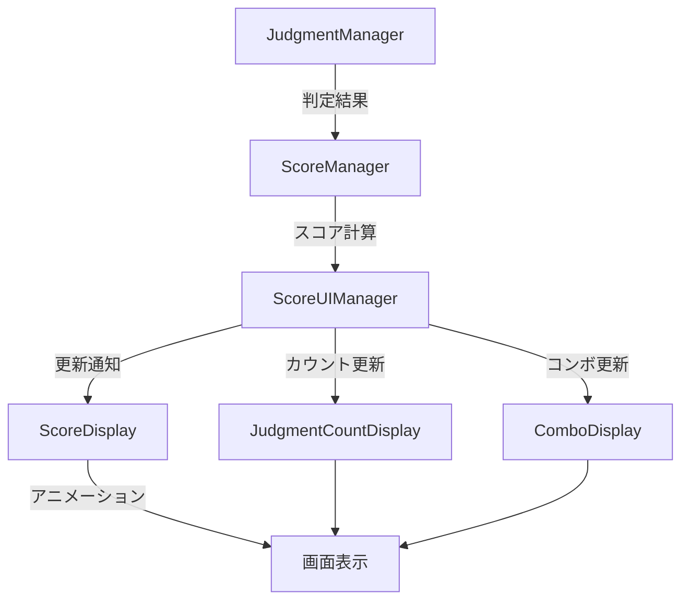

# スコアUIシステム設計書

## 概要

本ドキュメントでは、Jirouゲームプレイ画面に表示するスコアUIシステムの詳細設計を定義します。このシステムは、プレイヤーのスコアと判定結果（Perfect, Great, Good, Miss）をリアルタイムで表示・更新する機能を提供します。

## システム要件

### 機能要件

1. **スコア表示**
   - 現在のトータルスコアをリアルタイムで表示
   - 最大7桁（9,999,999）まで対応
   - アニメーション付きでスコア増加を演出

2. **判定カウント表示**
   - Perfect判定の累計カウント
   - Great判定の累計カウント
   - Good判定の累計カウント
   - Miss判定の累計カウント
   - 各カウントは最大4桁（9999）まで対応

3. **コンボ表示**
   - 現在のコンボ数を表示
   - コンボが途切れた際のリセット処理
   - 特定コンボ数達成時のエフェクト（50, 100, 200...）

4. **アニメーション要件**
   - スコア増加時の数値アニメーション
   - 判定発生時のポップアップエフェクト
   - コンボ継続時のビジュアルフィードバック

### 非機能要件

1. **パフォーマンス**
   - 60FPSを維持しながらUIを更新
   - TextMeshProを使用した効率的なテキストレンダリング
   - オブジェクトプールを使用したエフェクト管理

2. **視認性**
   - ゲームプレイを妨げない配置
   - 高コントラストな配色で常に読みやすく
   - 奥行き型ゲームに適したUI深度設定

3. **拡張性**
   - スキン変更に対応できる設計
   - 表示項目の追加・削除が容易
   - ローカライゼーション対応

## アーキテクチャ設計

### コンポーネント構成

```
ScoreUISystem/
├── ScoreUIManager         # UI全体の管理・更新制御
├── ScoreDisplay           # スコア表示コンポーネント
├── JudgmentCountDisplay   # 判定カウント表示コンポーネント
├── ComboDisplay          # コンボ表示コンポーネント
├── ScoreAnimator         # スコアアニメーション制御
└── UIEffectPool          # UIエフェクトのオブジェクトプール
```

### クラス設計

#### 1. ScoreUIManager

```csharp
public class ScoreUIManager : MonoBehaviour
{
    // 各表示コンポーネントへの参照
    private ScoreDisplay scoreDisplay;
    private JudgmentCountDisplay judgmentCountDisplay;
    private ComboDisplay comboDisplay;
    
    // ScoreManagerとの連携
    private ScoreManager scoreManager;
    
    // 更新制御
    void Start()
    void Update()
    void OnScoreChanged(int newScore)
    void OnJudgmentResult(JudgmentType type)
    void OnComboChanged(int combo)
}
```

#### 2. ScoreDisplay

```csharp
public class ScoreDisplay : MonoBehaviour
{
    // 表示要素
    private TextMeshProUGUI scoreText;
    private ScoreAnimator animator;
    
    // スコア管理
    private int currentDisplayScore;
    private int targetScore;
    
    // 表示更新
    public void SetScore(int score)
    public void AnimateToScore(int score, float duration)
    private void UpdateScoreText()
}
```

#### 3. JudgmentCountDisplay

```csharp
public class JudgmentCountDisplay : MonoBehaviour
{
    // 各判定タイプの表示要素
    private TextMeshProUGUI perfectCountText;
    private TextMeshProUGUI greatCountText;
    private TextMeshProUGUI goodCountText;
    private TextMeshProUGUI missCountText;
    
    // カウント管理
    private Dictionary<JudgmentType, int> judgmentCounts;
    
    // 表示更新
    public void IncrementCount(JudgmentType type)
    public void ResetCounts()
    private void UpdateCountText(JudgmentType type)
}
```

#### 4. ComboDisplay

```csharp
public class ComboDisplay : MonoBehaviour
{
    // 表示要素
    private TextMeshProUGUI comboNumberText;
    private TextMeshProUGUI comboLabelText;
    private CanvasGroup canvasGroup;
    
    // コンボ管理
    private int currentCombo;
    private Coroutine fadeCoroutine;
    
    // エフェクト
    private ParticleSystem comboEffect;
    
    // 表示更新
    public void SetCombo(int combo)
    public void ResetCombo()
    private void ShowComboEffect(int combo)
    private IEnumerator FadeInOut()
}
```

## UI レイアウト設計

### 画面配置

```
┌─────────────────────────────────────────┐
│  [Score: 0000000]              [♪ BGM]  │  ← 上部エリア
│                                          │
│  Perfect: 000  Great: 000               │  ← 判定カウントエリア
│  Good: 000     Miss: 000                │
│                                          │
│              [COMBO]                     │  ← 中央上部
│               [100]                      │
│                                          │
│         ゲームプレイエリア               │
│         （ノーツ・レーン）               │
│                                          │
└─────────────────────────────────────────┘
```

### Canvas設定

1. **UI Canvas設定**
   - Render Mode: Screen Space - Overlay
   - Sort Order: 100（ゲームプレイより前面）
   - Reference Resolution: 1920x1080
   - Screen Match Mode: 0.5

2. **階層構造**
```
Canvas/
├── TopPanel/
│   ├── ScoreContainer/
│   │   └── ScoreText (TMPro)
│   └── BGMIndicator/
├── JudgmentPanel/
│   ├── PerfectContainer/
│   │   ├── PerfectLabel
│   │   └── PerfectCount
│   ├── GreatContainer/
│   ├── GoodContainer/
│   └── MissContainer/
└── ComboPanel/
    ├── ComboLabel
    ├── ComboNumber
    └── ComboEffects/
```

## データフロー

### スコア更新フロー



### イベント連携

1. **ScoreManagerからのイベント**
   - `OnScoreUpdated(int newScore)`
   - `OnJudgmentProcessed(JudgmentType type, int points)`
   - `OnComboUpdated(int combo)`
   - `OnComboBreak()`

2. **UIManagerの購読処理**
   ```csharp
   void Start()
   {
       scoreManager.OnScoreUpdated += UpdateScoreDisplay;
       scoreManager.OnJudgmentProcessed += UpdateJudgmentCount;
       scoreManager.OnComboUpdated += UpdateComboDisplay;
       scoreManager.OnComboBreak += ResetComboDisplay;
   }
   ```

## ビジュアルデザイン仕様

### フォント設定

1. **スコア表示**
   - フォント: Digital-7 または類似のデジタルフォント
   - サイズ: 48pt
   - 色: #FFFFFF（白）
   - アウトライン: 2px #000000（黒）

2. **判定カウント**
   - フォント: Noto Sans JP Bold
   - サイズ: 24pt
   - 色: 
     - Perfect: #FFD700（ゴールド）
     - Great: #00FF00（緑）
     - Good: #00BFFF（水色）
     - Miss: #FF0000（赤）

3. **コンボ表示**
   - フォント: Impact または類似のインパクトフォント
   - サイズ: 36pt（数字）、18pt（ラベル）
   - 色: #FFFF00（黄色）
   - グロー効果: あり

### アニメーション仕様

1. **スコア増加アニメーション**
   - 種類: カウントアップ
   - 時間: 0.3秒
   - イージング: EaseOutQuad
   - 追加エフェクト: 増加時に一瞬拡大（1.1倍）

2. **判定ポップアップ**
   - 種類: フェードイン＋スケール
   - 時間: 0.5秒
   - 動き: 下から上へ軽く移動
   - 消失: 0.5秒後にフェードアウト

3. **コンボエフェクト**
   - 50コンボ: 黄色パーティクル
   - 100コンボ: 虹色パーティクル＋画面フラッシュ
   - 200コンボ以上: 継続的なオーラエフェクト

## パフォーマンス最適化

### 1. TextMeshPro最適化

```csharp
// 文字列結合を避ける
private StringBuilder scoreBuilder = new StringBuilder(7);

void UpdateScoreText()
{
    scoreBuilder.Clear();
    scoreBuilder.Append(currentScore.ToString("D7"));
    scoreText.text = scoreBuilder.ToString();
}
```

### 2. オブジェクトプール実装

```csharp
public class UIEffectPool : MonoBehaviour
{
    private Queue<GameObject> effectPool;
    
    public GameObject GetEffect()
    {
        if (effectPool.Count > 0)
            return effectPool.Dequeue();
        else
            return Instantiate(effectPrefab);
    }
    
    public void ReturnEffect(GameObject effect)
    {
        effect.SetActive(false);
        effectPool.Enqueue(effect);
    }
}
```

### 3. 更新頻度制御

```csharp
// 毎フレーム更新を避ける
private float updateInterval = 0.016f; // 60FPS
private float lastUpdateTime;

void Update()
{
    if (Time.time - lastUpdateTime >= updateInterval)
    {
        UpdateDisplays();
        lastUpdateTime = Time.time;
    }
}
```

## テスト計画

### ユニットテスト項目

1. **スコア計算テスト**
   - 各判定タイプでの正しいスコア加算
   - コンボボーナスの適用
   - 最大スコアの制限

2. **カウント精度テスト**
   - 判定カウントの正確性
   - リセット機能の動作
   - 最大カウント制限

3. **アニメーションテスト**
   - スムーズな数値遷移
   - エフェクトのタイミング
   - パフォーマンス影響

### 統合テスト項目

1. **実プレイテスト**
   - 60FPS維持の確認
   - 視認性の確認
   - レスポンシブな更新

2. **ストレステスト**
   - 高速連打時の表示
   - 長時間プレイでのメモリリーク
   - 大量エフェクト時のパフォーマンス

## 実装優先順位

1. **Phase 1: 基本表示機能**
   - ScoreDisplay実装
   - JudgmentCountDisplay実装
   - 基本的な数値更新

2. **Phase 2: コンボシステム**
   - ComboDisplay実装
   - コンボエフェクト基本版
   - コンボブレイク処理

3. **Phase 3: ビジュアル強化**
   - アニメーション実装
   - パーティクルエフェクト
   - 画面エフェクト

4. **Phase 4: 最適化**
   - パフォーマンスチューニング
   - メモリ使用量最適化
   - 描画負荷軽減

## 今後の拡張性

1. **マルチプレイヤー対応**
   - 複数プレイヤーのスコア表示
   - 順位表示機能
   - リアルタイム比較

2. **カスタマイズ機能**
   - UIスキン変更
   - 表示位置調整
   - 表示項目選択

3. **追加情報表示**
   - 精度グラフ
   - 判定分布
   - プレイ統計

## まとめ

本設計書では、Jirouゲームのスコア表示UIシステムについて、要件定義からアーキテクチャ設計、実装詳細までを定義しました。この設計に基づいて実装を進めることで、パフォーマンスと視認性を両立した、拡張性の高いスコアUIシステムを構築できます。